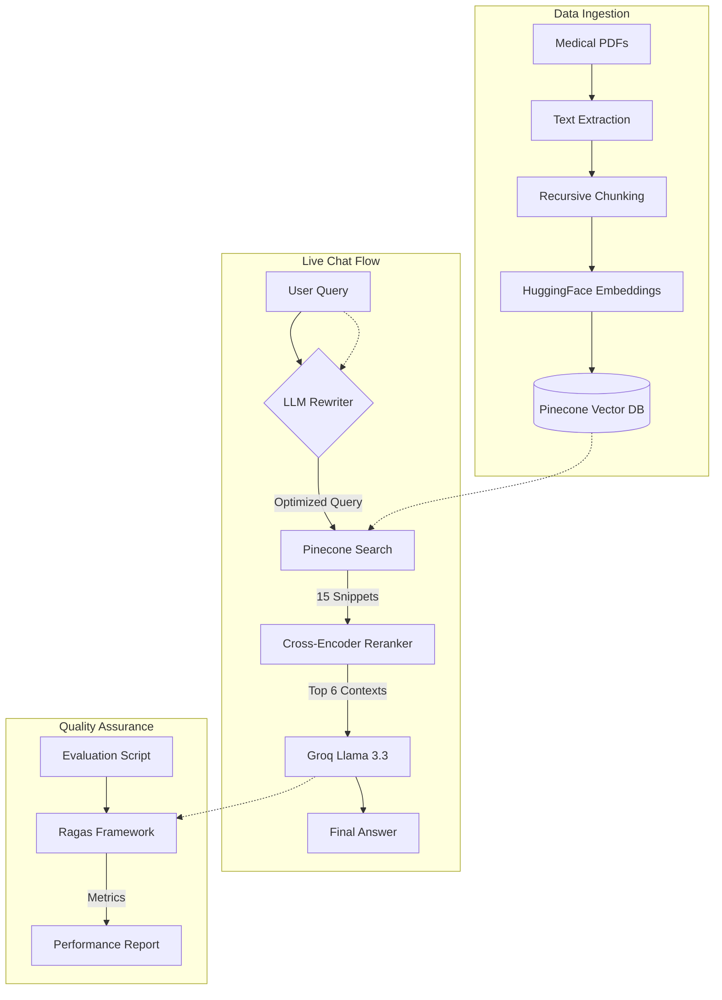

# Medical AI Chatbot: Master Technical Report (Beginner to Advanced)

This document provides a comprehensive breakdown of the Medical AI Chatbot's architecture, logic, and evaluation framework. It is designed to be accessible to beginners while providing the technical depth required by advanced developers.

---

## 1. Executive Summary: The RAG Paradigm
Retrieval-Augmented Generation (RAG) is the bridge between a Large Language Model's (LLM) reasoning capabilities and a private, authoritative dataset. Instead of relying on the LLM's internal (and potentially stale) knowledge, RAG forces the AI to look up facts in a curated database before answering.

## 2. System Design Diagram

## 3. Step 1: Data Ingestion & Chunking (The Foundation)

### Beginner: Breaking it Down
We take large PDFs (Medical Books) and cut them into smaller pieces called **Chunks**. 
- **Chunk Size:** We use ~500-1000 characters. 
- **Chunk Overlap:** We repeat about 10-20% of the text between chunks so that no sentence is cut in half and context is preserved.

### Advanced: Recursive Character Splitting
We don't just cut text at random character counts. We use a **Recursive Character Text Splitter**. 
- **Why?** It first tries to split at paragraphs (`\n\n`), then sentences (`. `), then words (` `). This ensures that each chunk is semantically coherent (it keeps full thoughts together).

---

## 3. Step 2: Vector Embeddings (Mathematical Meaning)

### Beginner: Translating to Numbers
Computers don't understand words; they understand numbers. An **Embedding Model** (we use HuggingFace) turns text into a long list of numbers called a **Vector**. 
- Words with similar meanings (e.g., "Physician" and "Doctor") end up with vectors that are "close" to each other in mathematical space.

### Advanced: High-Dimensional Semantic Space
The model places each chunk into a 384-dimensional space. When a user asks a question, we turn their question into a vector and use **Cosine Similarity** to find the "nearest neighbors"—the chunks whose vectors are most similar to the question's vector.

---

## 4. Step 3: Vector Database (Pinecone)

### Beginner: The AI's Library
**Pinecone** is a specialized database that stores these vectors. Traditional databases look for exact words; Pinecone looks for **intent** and **meaning**.

### Advanced: Indexing and Scalability
Pinecone uses advanced indexing (like HNSW) to allow sub-millisecond searches across millions of vectors. This ensures that as our medical library grows, the chatbot remains lightning-fast.

---

## 5. Step 4: The Query Rewriter (The Optimizer)

### Beginner: Fixing your Input
Users often use messy language (e.g., "what to eat for it?"). Our **Rewriter** (powered by Groq/Llama) looks at your chat history to figure out what "it" means and fixes your typos.

### Advanced: Contextual Reference Resolution
The rewriter uses a few-shot prompting strategy to transform conversational queries into **standalone search queries**. 
- **Process:** It extracts entities (e.g., "Abdominal Pain") and intent (e.g., "Dietary management") to build a dense, multi-facet search string that maximizes retrieval quality.

---

## 6. Step 5: Dual-Stage Retrieval (Retriever + Reranker)

### Beginner: Search vs. Edit
1.  **Retriever:** Finds 15 "likely" answers from the database.
2.  **Reranker:** A second, more precise AI (Cross-Encoder) reads all 15 and picks only the **Top 6** that truly matter.

### Advanced: Why Reranking?
Retrievers are fast but sometimes "loose" with relevance (Bi-Encoders). A **Cross-Encoder Reranker** processes the query and document *together*, allowing it to understand deep nuances that simple vector search might miss. This significantly reduces "noise" in the context.

---

## 7. Step 6: Generation (The Expert Consultant)

### Beginner: Writing the Answer
The AI (Groq/Llama 3.3) takes the Top 6 chunks and writes a professional response. We use a **System Prompt** to tell it to be empathetic, professional, and to NEVER lie.

### Advanced: Inference Acceleration with Groq
We use **Groq's LPU (Language Processing Unit)** infrastructure. Groq is significantly faster than standard cloud providers, delivering tokens almost instantly, which is critical for a smooth user experience in production.

---

## 8. Step 7: Evaluation (The Metrics)

We use the **Ragas** framework (powered by Groq) to scientifically measure our quality:

1.  **Faithfulness:** Does the answer come *only* from the context? (Safety metric).
2.  **Answer Relevance:** Does it actually answer the user? (User XP metric).
3.  **Context Precision:** Did the Reranker do its job correctly? (Search metric).
4.  **Context Recall:** Do we have enough info in our database? (Database metric).

---

## 9. Conclusion: Production Readiness
By combining **Pinecone** for storage, **Groq** for lightning-fast reasoning, and **Ragas** for continuous quality monitoring, this system is built to scale from a prototype to a professional-grade medical assistant.
