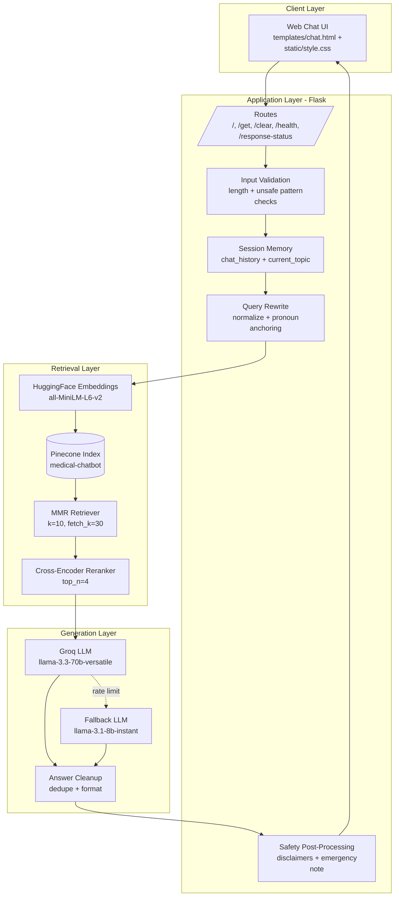
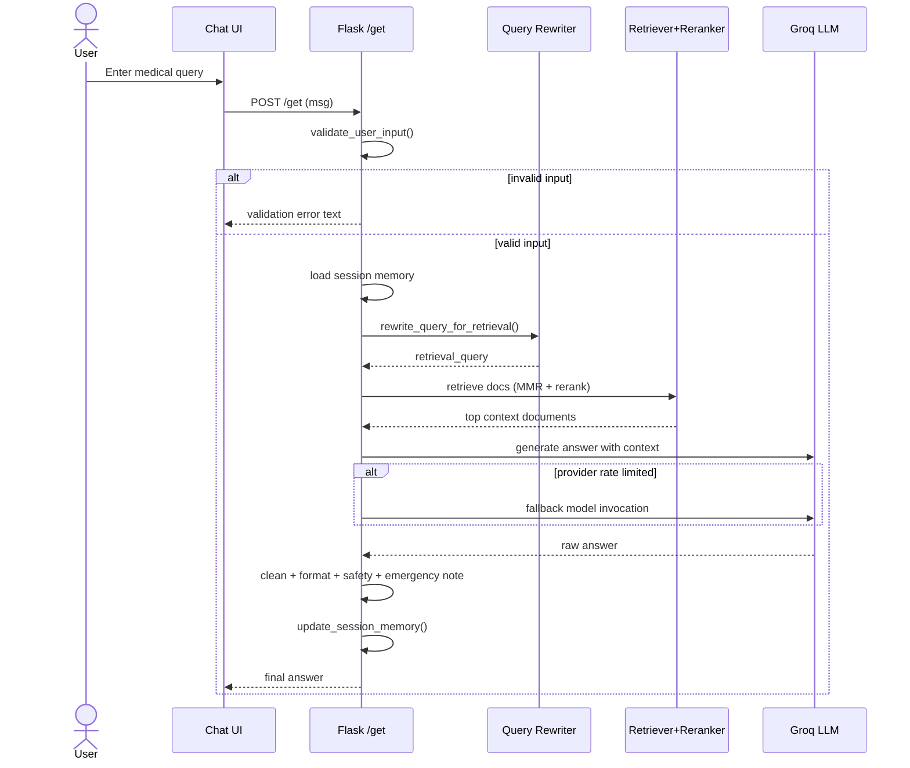
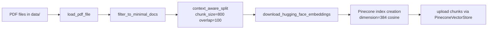

# SRS Alignment and Full System Design Package

**Project:** Medical AI Chatbot with RAG  
**Date:** 2026-05-06  
**Source SRS:** `docs/SRS_Report_IEEE.md`

## 1. SRS Compliance Verdict

**Short answer:** The SRS is **partially in accordance** with the implemented project.

### 1.1 Fully aligned areas
- RAG pipeline architecture exists and is implemented in `app.py`.
- Query rewrite, pronoun anchoring, topic memory, and retrieval reranking are implemented.
- Session-based chat memory with clear-chat route exists.
- Safety note appending and fallback model handling are implemented.
- Health endpoint and deployment-ready structure (Docker + Gunicorn) exist.

### 1.2 Previously partial or missing areas (now addressed)
- Input validation for unsafe HTML/script-like content.
- Input length cap aligned to SRS target (`500` chars).
- Explicit emergency keyword detection and urgent-care message path.
- Additional automated tests for validation and emergency flow.

### 1.3 Remaining non-functional gaps (operational)
- Hard SLA monitoring (`<5s`, uptime tracking, concurrent-user observability) is not yet instrumented with production telemetry.
- Live integration tests against real API providers are environment-dependent.

---

## 2. Full System Architecture (Mermaid)



---

## 3. End-to-End Runtime Workflow (Mermaid)



---

## 4. Document Indexing Workflow (Mermaid)



---

## 5. System Optimization Decisions Made

1. Retrieval quality optimization:
- Uses MMR (`k=10`, `fetch_k=30`, `lambda_mult=0.5`) to increase diversity.
- Uses cross-encoder reranking (`top_n=4`) to improve final context relevance.

2. Topic drift control:
- Pronoun anchoring ties ambiguous follow-up queries to recent topic.
- Current topic stored in session and reused for context-preserving turns.

3. Robustness and availability:
- Cached model/retriever initialization (`lru_cache`) lowers repeated startup cost.
- Fallback Groq model path handles rate limit conditions.
- `/health` endpoint supports container probes and load balancers.

4. Safety and readability:
- Post-processing removes prompt/meta leakage.
- Clinical safety note appended for treatment/medicine style questions.
- Emergency-keyword path adds urgent escalation notice.

5. Security hardening (basic):
- Environment-variable secrets usage.
- Input validation now rejects unsafe HTML/script-like payloads.
- Input length cap added to align with SRS constraints.

---

## 6. Complete Testing Strategy (Unit + Integration + System)

## 6.1 Unit tests
- Query classification and greetings.
- Query normalization/rewrite helpers.
- Input validation (`empty`, `>500`, script-like payloads).
- Response cleanup and safety-note behavior.
- Emergency keyword detection.

## 6.2 Integration tests
- Flask `/get` route validation behavior.
- Flask `/get` emergency response augmentation.
- Route-level behavior with mocked RAG chain invocations.

## 6.3 System tests
- End-to-end conversational flow with session memory and clear-chat reset.
- Health endpoint availability.
- Error-path survivability messaging.

## 6.4 Run commands

```bash
pytest -q tests/test_app.py
pytest -q tests/test_system_workflows.py
pytest -q
```

---

## 7. Requirement-to-Implementation Quick Mapping

| Requirement | Status | Implementation Notes |
|---|---|---|
| FR-QP-01 text input | Done | `/get` route |
| FR-QP-02 sanitization | Done (basic) | `validate_user_input` blocks script-like HTML payloads |
| FR-QP-03 reject empty | Done | `validate_user_input` |
| FR-QP-04 max 500 chars | Done | `MAX_QUERY_LENGTH = 500` |
| FR-QR pronoun resolution | Done | deterministic topic anchoring + rewrite chain |
| FR-DR retrieval + rerank | Done | MMR + cross-encoder compression retriever |
| FR-RG context-grounded generation | Done | RAG chain using retrieved context |
| FR-RG emergency guidance | Done | `detect_emergency_keywords` escalation message |
| FR-CM session memory | Done | cookie-backed history + topic tracking |
| NFR-SC env secrets | Done | `os.environ.get` usage |
| NFR-PF strict SLA telemetry | Partial | needs metrics/monitoring integration |

---

## 8. Attachable Summary

For your report submission, attach:
- `docs/SRS_Report_IEEE.md`
- `docs/SRS_ALIGNMENT_AND_FULL_SYSTEM_DESIGN.md`
- `docs/Testing_Documentation.md`
- `docs/diagrams/RAG_ARCHITECTURE_DIAGRAM.md`
- `docs/diagrams/RAG_SEQUENCE_DIAGRAM.md`
- `docs/diagrams/CICD_PIPELINE_DIAGRAM.md`
- `tests/test_app.py`
- `tests/test_system_workflows.py`
