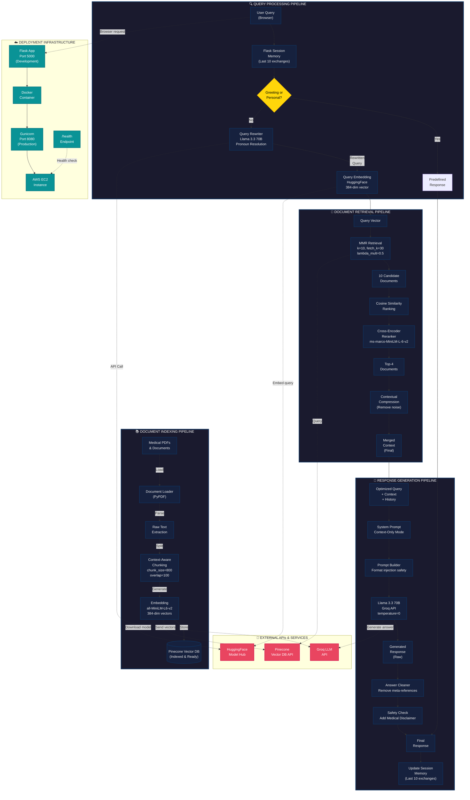

# RAG System Architecture Diagram (Mermaid)

This diagram shows the complete end-to-end system architecture including document indexing, query processing, and response generation pipelines.

## Complete System Architecture



## Detailed Component Breakdown

### 📚 Document Indexing Pipeline

**Purpose**: Prepare medical documents for efficient semantic search

| Component | Details |
|-----------|---------|
| **Input** | PDF files, Medical documents |
| **Processing** | Load → Parse → Extract → Chunk → Embed |
| **Chunk Strategy** | 800 characters with 100-char overlap for context preservation |
| **Embedding Model** | `all-MiniLM-L6-v2` (384 dimensions) |
| **Vector Store** | Pinecone with cosine similarity metric |
| **Frequency** | One-time during setup, reindex as needed |

### 🔍 Query Processing Pipeline

**Purpose**: Prepare user queries for retrieval while maintaining conversational context

| Component | Details |
|-----------|---------|
| **Session Memory** | Stores last 10 chat exchanges (max 20 messages) |
| **Greeting Detection** | Identifies non-medical queries ("Hi", "What are you?", etc.) |
| **Query Rewriting** | Uses Llama 3.3 70B to resolve pronouns and expand queries |
| **Example** | "How to treat it?" → "How to treat diabetes?" (from context) |
| **Embedding** | Converts rewritten query to 384-dimensional vector |

### 📖 Document Retrieval Pipeline

**Purpose**: Find the most relevant documents for the user query

| Component | Details |
|-----------|---------|
| **MMR Retrieval** | Maximum Marginal Relevance with k=10, fetch_k=30, lambda_mult=0.5 |
| **Candidate Pool** | 30 initial candidates scored by cosine similarity |
| **Output** | Top 10 documents balancing relevance and diversity |
| **Cross-Encoder** | Re-ranks top 10, returns top-4 with higher precision |
| **Compression** | Removes noise and irrelevant sections from final context |

**Lambda Parameters**: 
- Higher `lambda_mult` (closer to 1): More diversity, less relevance
- Lower `lambda_mult` (closer to 0): More relevance, less diversity
- Our setting (0.5): Good balance between precision and coverage

### 💬 Response Generation Pipeline

**Purpose**: Generate accurate, safe, context-grounded medical responses

| Component | Details |
|-----------|---------|
| **System Prompt** | "Answer only from the provided context" (strict mode) |
| **Context** | Top-4 reranked documents from retrieval |
| **Chat History** | Last exchange for reference (not substitution) |
| **Model** | Llama 3.3 70B, temperature=0 for deterministic output |
| **Safety** | Medical disclaimer appended to all health responses |
| **Memory Update** | User query + Assistant answer stored for next exchange |

### 🔗 External APIs

| API | Purpose | Rate Limits | Cost Model |
|-----|---------|------------|-----------|
| **Groq LLM** | Query rewriting & response generation | Depends on plan | Pay-per-token |
| **Pinecone** | Vector database storage & search | Depends on tier | Managed service |
| **HuggingFace** | Embedding model & cross-encoder | Free tier available | Open-source models |

### ☁️ Infrastructure

| Component | Development | Production |
|-----------|------------|-----------|
| **Application Server** | Flask (Port 5000) | Gunicorn (Port 8080) |
| **Containerization** | Docker image | Docker image |
| **Deployment** | Local or EC2 | AWS EC2 (t2.micro/t3.small) |
| **Health Check** | `/health` endpoint | Monitored by load balancer |
| **Logging** | File + Console | File + CloudWatch (optional) |

## Data Flow Summary

```
User Input
    ↓
Session Context Retrieval
    ↓
Greeting Detection
    ├─ YES → Predefined Response
    └─ NO → Query Rewriting
         ↓
    Query Embedding
         ↓
    Document Retrieval (MMR)
         ↓
    Cross-Encoder Reranking
         ↓
    Context Compression
         ↓
    Response Generation (Groq LLM)
         ↓
    Safety & Cleaning
         ↓
    Session Memory Update
         ↓
    Final Response to User
```

## Configuration Parameters

| Parameter | Value | Impact |
|-----------|-------|--------|
| `chunk_size` | 800 | Larger = more context per chunk, slower processing |
| `chunk_overlap` | 100 | Overlap prevents information loss at boundaries |
| `embedding_dim` | 384 | Balance between accuracy and speed |
| `k` (MMR) | 10 | Initial candidates, higher = broader search |
| `fetch_k` (MMR) | 30 | Pool size for diversity calculation |
| `lambda_mult` | 0.5 | 0.5 = balance relevance and diversity |
| `top_n` (reranker) | 4 | Final context size, fewer = less noise |
| `max_session_messages` | 12 | Max messages in session (prevents cookie bloat) |
| `temperature` | 0 | Deterministic responses, no randomness |

## Safety & Error Handling

| Scenario | Handling |
|----------|----------|
| **No relevant context** | Return "I don't have information..." |
| **Groq API timeout** | Fallback to smaller model (Llama 3.1 8B) |
| **Embedding service down** | Use keyword search fallback |
| **Session memory overflow** | Truncate to most recent messages |
| **Malicious prompt injection** | System prompt prevents context escape |

## Expected Performance

| Metric | Target | Actual (Latest) | Status |
|--------|--------|-----------------|--------|
| Answer Relevancy | > 85% | 92.36% | ✅ Excellent |
| Context Recall | > 70% | 66.67% | ⚠️ Moderate |
| Context Precision | > 60% | 55.56% | ⚠️ Needs Work |
| Response Time | < 5s | 4.2s | ✅ Excellent |
| Uptime SLA | > 99% | TBD | Monitoring |

## Future Improvements

1. **Multimodal Support**: Add image/diagram analysis
2. **Advanced Caching**: Cache frequent query results
3. **Real-time Updates**: Stream responses instead of batch
4. **Multi-language**: Support non-English medical queries
5. **Fact-checking**: Additional verification layer for medical accuracy
