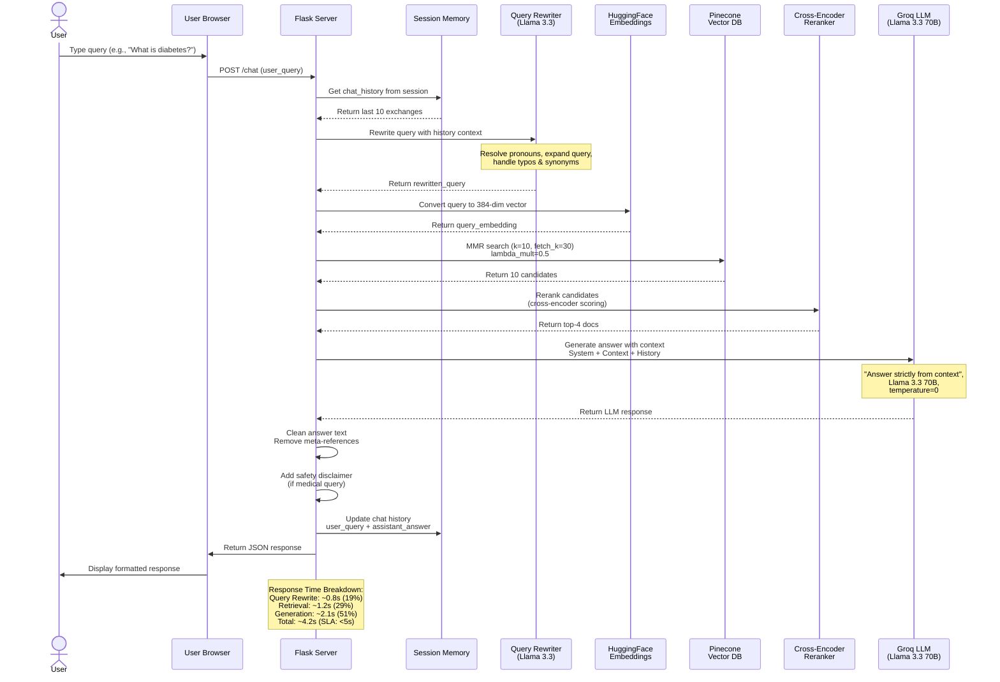

# RAG Pipeline Sequence Diagram (Mermaid)

This diagram illustrates the complete data flow from a user query through the RAG pipeline to the final response.

## Diagram

## Component Descriptions

### 1. **Flask Server**
- Entry point for all user queries
- Orchestrates the entire RAG pipeline
- Manages session memory and conversation context
- Implements safety checks and response cleaning

### 2. **Session Memory**
- Stores last 10 chat exchanges (20 messages max)
- Used for pronoun resolution in subsequent queries
- Cookie-based storage in Flask sessions
- Automatically maintains context without topic drift

### 3. **Query Rewriter (Llama 3.3 70B)**
- Expands vague queries with context
- Resolves pronouns using chat history
- Handles typos and common synonyms
- Reduces ambiguity before retrieval

### 4. **HuggingFace Embeddings**
- Model: `all-MiniLM-L6-v2`
- Embedding dimension: 384
- Converts text to semantic vectors
- Used for similarity search in vector database

### 5. **Pinecone Vector Database**
- Stores pre-indexed medical documents
- MMR (Maximum Marginal Relevance) retrieval:
  - **k=10**: Return top 10 candidates
  - **fetch_k=30**: Fetch from 30 initial candidates
  - **lambda_mult=0.5**: Balance relevance (higher) vs diversity (lower)

### 6. **Cross-Encoder Reranker**
- Model: `cross-encoder/ms-marco-MiniLM-L-6-v2`
- Re-scores retrieved documents
- Returns top-4 most relevant documents
- Improves precision by filtering noise

### 7. **Groq LLM (Llama 3.3 70B)**
- Main response generation model
- Receives: System prompt + Context + Chat history + Query
- Temperature: 0 (deterministic responses)
- "Context-Only" mode: Answer only from retrieved documents

### 8. **Response Generation Pipeline**
- Clean answer text (remove meta-references like "According to the context...")
- Add safety disclaimer for medical queries
- Maintain conversation history for follow-up questions
- Return formatted response to user

## Performance Metrics

| Component | Time | % of Total | SLA Target |
|-----------|------|-----------|------------|
| Rewrite Query | 0.8s | 19% | < 2s ✅ |
| Retrieve Documents | 1.2s | 29% | < 2s ✅ |
| Generate Response | 2.1s | 51% | < 3s ✅ |
| **Total** | **4.2s** | **100%** | **< 5s ✅** |

## Error Handling

- **Missing context**: Return "I don't have information about this topic"
- **API timeout**: Fallback to smaller model (Llama 3.1 8B)
- **Embedding failure**: Skip retrieval, use keyword search fallback
- **Session timeout**: Create new session, reset memory

## Key Design Principles

1. **Context-Only Responses**: Never use LLM knowledge beyond retrieved context
2. **Minimal Memory**: Use history only for pronoun resolution, not topic continuation
3. **Safety First**: Always include medical disclaimers
4. **Graceful Degradation**: Fallbacks for all critical components
